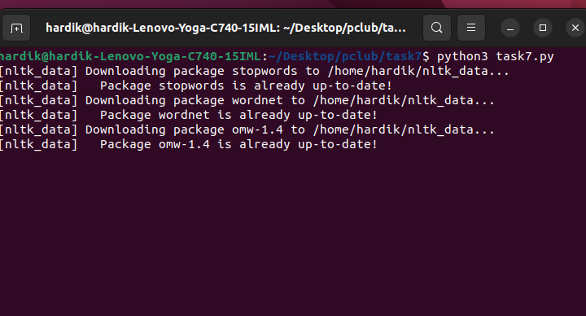
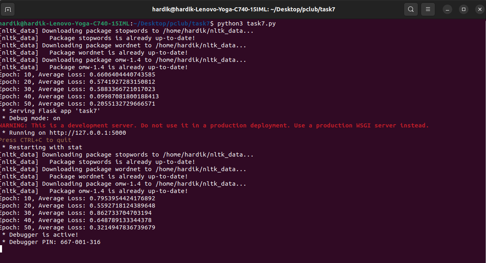
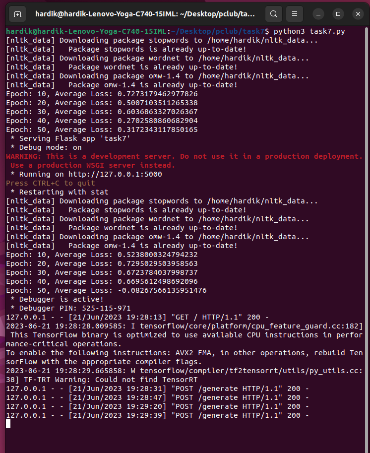
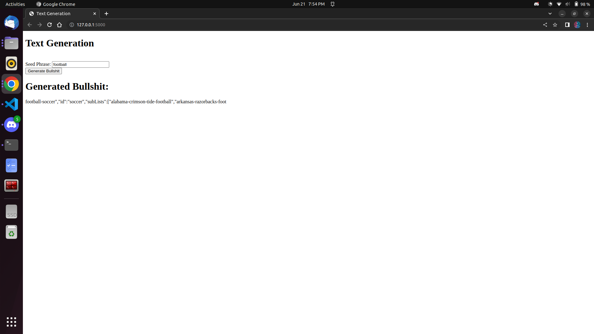

# Clickbait Generator 
This model is a text generation system based on the GPT-2 (Generative Pre-trained Transformer 2) architecture. It can generate relevant text given a seed phrase. 
The model is trained on a large dataset and has learned to predict the next word or sequence of words based on the previous context. 
The Flask application is created using the Flask module.The user input is received as JSON data and parsed in the 'generate' function. 
The 'inputText' values are extracted from the JSON data. The generated text is returned as a JSON response.

> The documentation of the model is present as `Clickbait generator.pdf` in the repository

## Installing Dependencies
+ To install transformers, follow this step:
```
pip install transformers
```
+ To install nltk, follow this step:
```
pip install nltk
```
+ To install scikit-learn, follow this step:
```
pip install scikit-learn
```
+ To install random, follow this step:
```
pip install random
```
+ To install flask, follow this step:
```
pip install flask
```
+ To install the CPU version of PyTorch using pip, you can use the following command.
```
pip install torch torchvision
```
  If you have a CUDA-enabled GPU and want to install the GPU version of PyTorch, you can use the following command instead:
```
pip install torch torchvision torchaudio
```

## Loading the model
+ The primary step is to clone the github repo `git@github.com:hardik1408/task7.git` into your system.
+ Due to space issue, the trained model having all the weights and biases could not be uploaded directly on github. So instead, I created a drive link for the same:
```
https://drive.google.com/drive/folders/1Ib3ifC4rij0C4jExjpvwHkVfgnCLOjtv?usp=drive_link
```
+ Create a new folder named as `trained_model` and save all the files from the drive link there.

## Running the model
+ Open terminal in the root directory.
+ Use the following command to run the python file:
```
python3 task7.py
```
+ The system will start downloading necessary files and dependencies
  
+ After all the necessary files have been downloaded, the training process will start and the number of epochs completed will be displayed.

+ Next, the `Flask app` will start running on `http://127.0.0.1:5000`. Follow this link to open the text generator.
 

  ### Bingo!!
  You are all set and ready to use the clickbait generator for some random text generation.
  This generator produces random text everytime you use it, even for the same seed phrase

  ## Some examples
  
  
  
  To see more examples, [click here](examples)


